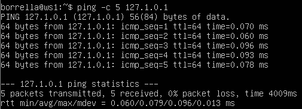
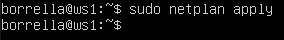
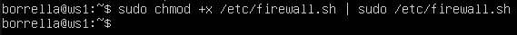
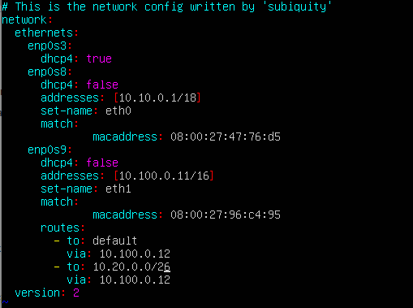
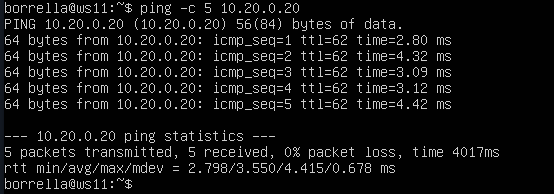
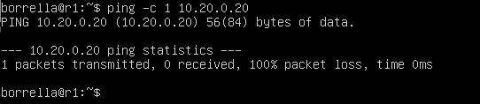
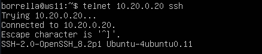

# **Report for DO2_LinuxNetwork-1**

## **Part 1. Инструмент ipcalc**

### **1.1 Сети и маски**

- 1. Адрес сети 192.167.38.54/13 это 192.160.0.0/13

- 2.1. Перевод маски 255.255.255.0 в префиксную и двоичную запись

    - Префиксная запись - '/24'

    - Двоичная запись - '11111111.11111111.11111111.00000000'

- 2.2. '/15' в обычную и двоичную.

    - Обычная запись - '255.254.0.0'

    - Двоичная запись - '11111111.11111110.00000000.00000000'

- 2.3 '11111111.11111111.11111111.11110000' в обычную и префиксную

    - Обычная запись - '255.255.255.240'

    - Префиксная запись - '/24'

- 3. Минимальный и максимальный хост в сети 12.167.38.4 при масках: /8, 11111111.11111111.00000000.00000000, 255.255.254.0 и /4

    - 3.1 При маске - '/8' минимальный хост: '12.0.0.1, максимальный хост: '12.255.255.254'

 

    - 3.2 При маске - '1111111.11111111.00000000.00000000' минимальный хост: '12.167.0.1, максимальный хост: '12.167.255.254'

 

    - 3.3 При маске - '255.255.254.0' минимальный хост: '12.167.38.1, максимальный хост: '12.167.39.254'

 

    - 3.3 При маске - '/4' минимальный хост: '0.0.0.1, максимальный хост: '15.255.255.254'

 

 ---

 ### **1.2 localhost**

 - 1. Определи и запиши в отчёт, можно ли обратиться к приложению, работающему на localhost, со следующими IP: 194.34.23.100, 127.0.0.2, 127.1.0.1, 128.0.0.1

    - 1.1. С ip 194.34.23.100 нельзя обратиться к приложению работающему на localhost так как данный ip не находиться в диапозоне ip адресов относящихся к localhost '127.0.0.1 - 127.255.255.254' и адрес не является обратной петлей (Loopback). Это можно определить с помощью ipcalc и командой ping.

    - 1.2. С ip 127.0.0.2 можно обратиться к приложению работающему на localhost так как данный ip находиться в диапозоне ip адресов относящихся к localhost '127.0.0.1 - 127.255.255.254' и адрес является обратной петлей (Loopback). Это можно определить с помощью ipcalc и командой ping.

    - 1.3. С ip 127.1.0.1 можно обратиться к приложению работающему на localhost так как данный ip находиться в диапозоне ip адресов относящихся к localhost '127.0.0.1 - 127.255.255.254' и адрес является обратной петлей (Loopback). Это можно определить с помощью ipcalc и командой ping.

    - 1.4. С ip 128.0.0.1 нельзя обратиться к приложению работающему на localhost так как данный ip не находиться в диапозоне ip адресов относящихся к localhost '127.0.0.1 - 127.255.255.254' и адрес не является обратной петлей (Loopback). Это можно определить с помощью ipcalc и командой ping.

---

### **1.3 Диапазоны и сегменты сетей**

- 1. Какие из перечисленных IP можно использовать в качестве публичного, а какие только в качестве частных: 10.0.0.45, 134.43.0.2, 192.168.4.2, 172.20.250.4, 172.0.2.1, 192.172.0.1, 172.68.0.2, 172.16.255.255, 10.10.10.10, 192.169.168.1

    - В качестве публичного можно использовать - 134.43.0.2, 172.0.2.1, 192.172.0.1, 172.68.0.2, 192.169.168.1

    - В качестве частных можно использовать - 10.0.0.45, 192.168.4.2, 172.20.250.4, 172.16.255.255, 10.10.10.10

- Для определения ip к частной сети или к публичной сети можно восползоваться диапозонами адресов частных ip адресов.

- Но для более точного определения можно обратиться к утилите ipcalc. В выведенных данных в строке Hosts/Net если сеть частная выведет надпись 'Private Internet' Прилагаю скриншоты для подтверждения.

- Результат вывода ipcalc для публичных сетей:

- Результат вывода ipcalc для частных сетей:

- 2. Какие из перечисленных IP адресов шлюза возможны у сети 10.10.0.0/18: 10.0.0.1, 10.10.0.2, 10.10.10.10, 10.10.100.1, 10.10.1.255

    - Диапазон ip адресов у сети 10.10.0.0/18 является: '10.10.0.1 - 10.10.63.254'. Эти данные определяются с помощью утилиты ipcalc и выводятся в строках HostMin и HostMax.

- С учетом вышесказанного определяем какие ip адреса возможны, какие нет:

    - Возможны - 10.10.0.2, 10.10.10.10, 10.10.1.255

    - Невозможны - 10.0.0.1, 10.10.100.1

---

## **Part 2. Статическая маршрутизация между двумя машинами**

- Вывод команды 'ip a' на двух виртуальных машинах - ws1 и ws-2

- Внутренней сетью для вирутальных машин ws1 и ws-2 являются enp0s3 так как он имеет ip адрес 10.0.2.15 который находиться в диапазоне '10.0.0.0 - 10.255.255.255', данный интерфейс имеет маску подсети 15 и находится в подсети класса А. Состояние интерфейса - UP, максимальный размер пакета данных (MTU) - 1500, метод управления трафиком (qdisc) - fq_codel, информация о физическом соединении, включая MAC-адрес устройства (link/ether) - 08:00:27:0d:32:10 brd ff:ff:ff:ff:ff:ff, область действия адреса (scope) - global, Рекомендуемый период времени использования адреса (preferred_lft) - forever.

- Содержание измененного файла 00-installer-config.yaml в ws1

- Содержание измененного файла 00-installer-config.yaml в ws-2

- Вывод выполнения команды netplan apply для ws1

- Вывод выполнения команды netplan apply для ws-2

- **2.1** Добавление статического маршрута вручную

- Для добавления статического маршрута вручную использую команду ip r add.
    
    - Для машины ws1 использую команду ip r add 172.24.116.8 dev enp0s3 - то есть указываю ip адрес машины ws-2 и наименования устройства (сетевого интерфейса)

    - Для машины ws-2 использую команду ip r add 192.168.100.10 dev enp0s3 - то есть указываю ip адрес машины ws1 и наименования устройства (сетевого интерфейса)

- Результат пропинговывания с машины ws1 адрес машины ws-2

- Результат пропинговывания с машины ws-2 адрес машины ws1

- **2.2** Добавление статического маршрута с сохранением

- Добавление статического маршрута между машинами ws1 и ws-2 с помощью редактирования файла /etc/netplan/00-installer-config.yaml.

- Содержимое файла /etc/netplan/00-installer-config.yaml. для машины ws1

- Содержимое файла /etc/netplan/00-installer-config.yaml. для машины ws-2

- Результат пропинговывания с машины ws1 адрес машины ws-2

- Результат пропинговывания с машины ws-2 адрес машины ws1

---

## **Part 3. Утилита iperf3**

- **3.1.** Скорость соединения

- Переводим заданные скорости: 8 Mbps в MB/s, 100 MB/s в Kbps, 1 Gbps в Mbps.

- Для перевода скоростей надо определить что такое 'Mbps', 'MB/s', 'Kbps', 'Gbps'.
    
    - Mbps - Megabit per second - Мегабит в секунду;

    - MB/s - Megabyte per second - Мегабайт в секунду (1 MB/s = 8 Mbps);

    - Kbps - Kilobits per second - Килобит в секунду (1 Kbps = 0.000125 MB/s);

    - Gbps - Gigabits per second - Гигабит в секунду (1 Gbps = 125 MB/s);

- Следуя вышесказанному определяем скорости:

    - 8 Mbps = 1 MB/s;

    - 100 MB/s = 800000 Kbps;

    - 1 Gbps = 1000 Mbps.

- **3.2.** Утилита iperf3

- Определяем скорость соединения между машинами ws1 и ws-2

- На машине ws1 запускаем сервер утилиты ipref3 с помощью команды ipref3 -s, для того чтоб машина принимала входящее соединение.

- На машине ws-2 запускаем клиент утилиты ipref3 для отправки данных на машину ws1 с помощью команды ipref3 -c 192.168.100.10

---

## **Part 4. Сетевой экран**

- **4.1.** Утилита iptables

- Содержимое файла /etc/firewall.sh на машине ws1 после введения правил по заданию с помощью утилиты iptables.

- Содержимое файла /etc/firewall.sh на машине ws-2 после введения правил по заданию с помощью утилиты iptables.

- Запуск файла на машине ws1 командами chmod +x /etc/firewall.sh и /etc/firewall.sh

- Запуск файла на машине ws-2 командами chmod +x /etc/firewall.sh и /etc/firewall.sh

- Показ всех правил на машине ws1 с помощью команды iptables -L

- Показ всех правил на машине ws-2 с помощью команды iptables -L

- Проверка работоспособности firewall-а на машине ws1

- Проверка работоспособности firewall-а на машине ws-2

- Разница между стратегиями
Стратегия, примененная на ws1, заключается в том, что в начале пишется запрещающее правило, а в конце пишется разрешающее правило. Это означает, что по умолчанию все соединения будут заблокированы, и только те, которые явно разрешены, будут проходить через фаервол. Стратегия, примененная на ws2, заключается в том, что в начале пишется разрешающее правило, а в конце пишется запрещающее правило. Это означает, что по умолчанию все соединения будут разрешены, и только те, которые явно запрещены, будут блокироваться.

- **4.2.** Утилита nmap

- Попытка пропинговывания с машины ws1 на который стоит запрет пинга, ip адрес машины ws-2 .

- Вывод команды nmap с машины ws1 ip адрес машины ws-2

---

## **Part 5. Статическая маршрутизация сети**

- **5.1.** Настройка адресов машин

- Содержимое файла /etc/netplan/00-installer-config.yaml для машины ws11

- Содержимое файла /etc/netplan/00-installer-config.yaml для машины r1

- Содержимое файла /etc/netplan/00-installer-config.yaml для машины r2

- Содержимое файла /etc/netplan/00-installer-config.yaml для машины ws21

- Содержимое файла /etc/netplan/00-installer-config.yaml для машины ws22

- Результаты выполнения команд ip -4 a и пропинговывания от машины ws11 машину r1.

- Результаты выполнения команд ip -4 a и пропинговывания от машины r1 машину ws11 и также от r1 к r2.

- Результаты выполнения команд ip -4 a и пропинговывания от машины r2 машину r1 и также от r1 к ws21 и от r1 к ws22.

- Результаты выполнения команд ip -4 a и пропинговывания от машины ws21 машину ws22 и также от ws21 к r1.

- Результаты выполнения команд ip -4 a и пропинговывания от машины ws22 машину ws21 и также от ws22 к r1.

- **5.2** Включение переадресации IP-адресов

- Включение переадресации IP на машине r1 с помощью команды sysctl -w net.ipv4.ip_forward=1

- Включение переадресации IP на машине r2 с помощью команды sysctl -w net.ipv4.ip_forward=1

- Для постоянного использование переадресации IP на машине r1 редактирую содержимое файла /etc/sysctl.conf и добавляю строку (раскоммичиваю) net.ipv4.ip_forward = 1

- Для постоянного использование переадресации IP на машине r2 редактирую содержимое файла /etc/sysctl.conf и добавляю строку (раскоммичиваю) net.ipv4.ip_forward = 1

- **5.3** Установка маршрута по-умолчанию

- Содержимое файла etc/netplan/00-installer-config.yaml для машины ws11

- Содержимое файла etc/netplan/00-installer-config.yaml для машины ws21

- Содержимое файла etc/netplan/00-installer-config.yaml для машины ws22

- Содержимое файла etc/netplan/00-installer-config.yaml для машины r1

- Содержимое файла etc/netplan/00-installer-config.yaml для машины r2

- Вывод команды ip r для машины ws11

- Вывод команды ip r для машины ws21

- Вывод команды ip r для машины ws22

- Вывод команды ip r для машины r1

- Вывод команды ip r для машины r2

- Вывод результата пропинговывания роутера r2 машиной ws11

- Вывод результата прослушивания пропинговывания роутера r2 машиной ws11

- **5.4** Добавление статических маршрутов

- Содержимое конфигурационного файла etc/netplan/00-installer-config.yaml после добавления статического маршрута на машине r1

- Содержимое конфигурационного файла etc/netplan/00-installer-config.yaml после добавления статического маршрута на машине r2

- Вывод команды ip r для машины r1

- Вывод команды ip r для машины r1

- Вывод команд ip r list 10.10.0.0/18 и ip r list 0.0.0.0/0 на машине ws11

- После вызова команд ip r list 10.10.0.0/18 и ip r list 0.0.0.0/0 на машине ws11 вышли разные результаты потому что вывод команды ip r list 10.10.0.0/18 содержит информацию о маршрутах которые относятся только к подсети 10.10.0.0/18, а вывод команды ip r list 0.0.0.0/0 содержит информацию о маршрутах по умолчанию.

- **5.5.** Построение списка маршрутизаторов

- Вывод команды tcpdump -tnv -i eth0 на машине r1 во время использования утилиты traceroute

- Вывод команды traceroute 10.20.0.10 на машине ws11

- Traceroute — это утилита, которая позволяет определить путь, по которому проходит сетевой трафик между двумя узлами сети. Она работает, отправляя серию пакетов с увеличивающимся временем ожидания (timeout) и отслеживая, сколько времени требуется каждому пакету, чтобы достичь своего пункта назначения. Принцип работы traceroute заключается в следующем: Утилита traceroute отправляет пакеты с очень маленьким временем ожидания (timeout), обычно около 1 мс.(Это видно в строке ttl 1) Когда пакет достигает первого маршрутизатора на пути к пункту назначения, этот маршрутизатор отвечает на него ICMP-сообщением об ошибке "Time Exceeded". Это сообщение содержит информацию о том, что время ожидания истекло, и поэтому пакет был отброшен.Утилита traceroute записывает IP-адрес и имя хоста (если оно доступно) этого маршрутизатора. Затем traceroute увеличивает время ожидания и повторяет процесс, пока не достигнет пункта назначения. По мере прохождения пакетов через каждый маршрутизатор на пути к пункту назначения, traceroute записывает время, затраченное на прохождение каждого сегмента пути. В конце процесса traceroute выводит список всех промежуточных узлов (маршрутизаторов), а также время, затраченное на прохождение через каждый из них.

- **5.6.** Использование протокола ICMP при маршрутизации

- Вывод команды tcpdump -n -i eth0 icmp на машине r1 во время пропинговывания несуществующего адреса с машины ws11

- Пропинговывание несуществующего адреса с машины ws11 в моем случае адрес 10.30.45.183

---

## **Part 6. Динамическая настройка IP с помощью DHCP**

- Измененный файл /etc/dhcp/dhcpd.conf на машине r2

- Измененный файл /etc/resolv.conf на машине r2

- Вывод команды systemctl restart isc-dhcp-server на машине r2

- Вывод команды ip a после reboot на машине ws21

- Пропинговывание машины ws22 с машины ws21

- Измененный файл /etc/netplan/00-installer-config.yaml на машине ws11

- Измененный файл /etc/dhcp/dhcpd.conf на машине r1

- Измененный файл /etc/resolv.conf на машине r1

- Вывод команды systemctl restart isc-dhcp-server на машине r1

- Вывод команды ip a после reboot на машине ws11

- Пропинговывание машины ws22 с машины ws11

- Вывод команды ip a до обновления сети 

- Вывод команды ip a после обновления сети, для обновления использовалась команда dhclient -r

- Настройками конфигурации службы DHCP (адрес маршрутизатора по-умолчанию, DNS-сервер, адрес внутренней сети, привязка к MAC-адресу)

- Клиентом протокола динамической конфигурации хоста - команда dhclient с флагом -r для обновления или освобождения IP-адреса.

---

## **Part 7. NAT**

- Содержание измененного файла /etc/apache2/ports.conf на машине ws22

- Запуск веб-сервера Apache командой service apache2 start на ws22

- Содержание измененного файла /etc/apache2/ports.conf на машине r1

- Запуск веб-сервера Apache командой service apache2 start на r1

- Добавление в фаервол на машине r2, следующих правил:

    - Удаление правил в таблице filter - iptables -F;

    - Удаление правил в таблице "NAT" - iptables -F -t nat;

    - Отбрасывать все маршрутизируемые пакеты - iptables --policy FORWARD DROP

- Запуск файла /etc/firewall.sh на машине r2

- Попытка пропинговать машину ws22 с машины r1. Не работает значит все правильно.

- Добавление еще одного правила а firewall машины r2

    - Разрешить маршрутизацию всех пакетов протокола ICMP

- Запуск файла /etc/firewall.sh на машине r2

- Попытка пропинговать машину ws22 с машины r1. Работает значит все правильно.

- Добавление еще двух правил на firewall машины r2

    - Включение SNAT, а именно маскирование всех локальных ip из локальной сети, находящейся за r2 (по обозначениям из Части 5 - сеть 10.20.0.0);

    - Включение DNAT на 8080 порт машины r2 и добавить к веб-серверу Apache, запущенному на ws22, доступ извне сети.

- Запуск файла /etc/firewall.sh на машине r2

- Тест соединения по TCP для SNAT с машины ws22 к серверу Apache на r1 командой telnet 10.10.0.1 80

- Тест соединение по TCP для DNAT с машины r1 к серверу Apache на ws22 командой telnet 10.20.0.1 8080

---

## **Part 8. Дополнительно. Знакомство с SSH Tunnels**

- Измененный файл /etc/apache2/ports.conf на машине ws22

- Для Local TCP forwarding с ws21 до ws22, использовал команду ssh -L 8080:localhost:22 10.20.0.20

- Для Remote TCP forwarding c ws11 до ws22, использовал команду ssh -R 5555:localhost:80 ws-2@10.20.0.20

- Проверка подключения двух предыдущих пунктов

- Проверка на ws21

- Проверка на ws11

